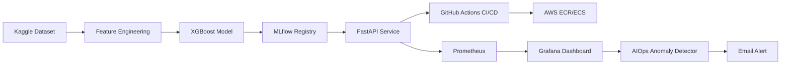

# MLOps Fraud Detection Pipeline


End-to-end MLOps system for credit card fraud detection — from model training and MLflow registry promotion to FastAPI inference, Prometheus/Grafana observability, Evidently drift detection, and incident-driven alerting. The focus is production behavior under monitoring and deployment constraints, not just model score reporting.

## Architecture



**Data flow**: Kaggle dataset → feature engineering (drop Time, scale Amount) → XGBoost with `scale_pos_weight=577` for 577:1 class imbalance → MLflow registry with `@champion` alias → FastAPI serving → CI fetches champion model, builds Docker image, pushes to ECR → ECS Fargate deployment.

**Monitoring flow**: Prometheus scrapes API request/fraud/confidence metrics → Grafana evaluates alert rules → batch drift check (Evidently) pushes to Pushgateway → Grafana routes threshold breaches to email.

## Project Structure

```
mlops-fraud-pipeline/
├── src/
│   ├── api/
│   │   ├── main.py              # FastAPI app (predict, health, metrics)
│   │   └── monitoring.py        # Prometheus custom metrics
│   └── model/
│       └── train.py             # XGBoost training with MLflow tracking
├── scripts/
│   ├── download_data.py         # Kaggle dataset download
│   ├── drift_check.py           # Evidently drift detection → Pushgateway
│   ├── fetch_model.py           # Pull champion model from MLflow registry
│   ├── generate_reference.py    # Create drift baseline from training data
│   └── simulate_incident.py     # Fraud spike & distribution shift simulation
├── tests/
│   └── test_api.py              # API endpoint tests (7 tests)
├── docker/
│   ├── prometheus.yml           # Prometheus scrape config
│   └── grafana/provisioning/    # Grafana datasources, dashboards, alerts
├── docs/
│   ├── architecture.md          # Architecture narrative
│   ├── architecture.html        # Interactive architecture diagram
│   └── incident-simulation.md   # Incident response documentation
├── data/processed/
│   └── reference.csv            # 5000-row drift baseline
├── Dockerfile                   # FastAPI production image
├── docker-compose.yml           # Full local stack
├── render.yaml                  # Render.com deployment config
├── requirements.txt
└── .github/workflows/ci-cd.yml  # Test → Build → ECR push pipeline
```

## Stack

| Layer | Technology | Why not X |
|-------|------------|-----------| 
| Model | XGBoost with `scale_pos_weight` | Logistic regression was rejected — non-linear feature interaction matters in anonymized PCA space and recall collapses under extreme imbalance. |
| API | FastAPI + Uvicorn | Flask was rejected — strict request typing and automatic OpenAPI schema are required for predictable MLOps handoff. |
| Drift detection | Evidently DataDriftPreset | Custom drift logic was rejected to avoid under-tested statistical code and inconsistent thresholds. |
| Experiment tracking | MLflow 3.x with `@champion` alias | Local-only artifacts were rejected — promotion and rollback need explicit version metadata. |
| Monitoring | Prometheus + Grafana + Pushgateway | CloudWatch-only was rejected — request, model, and batch drift metrics need one query language and one dashboard. |
| Deployment | Docker Compose (local), AWS ECS/Fargate (prod) | EC2-backed ECS was rejected to avoid instance patching and scaling overhead. |
| Language | Python 3.11 | Older versions were rejected for dependency compatibility with modern FastAPI, MLflow, and Evidently. |

## Monitoring & Alerting

Grafana alert rules are provisioned from `docker/grafana/provisioning/alerting/`.

| Rule | Condition | Threshold Reasoning |
|------|-----------|---------------------|
| Fraud Rate Spike | `rate(fraud[5m]) / rate(total[5m]) > 0.005` | Baseline fraud is 0.17%; 0.5% is ~3x baseline — high enough to avoid noise, low enough to catch degradation. |
| Data Drift Warning | `drift_share_of_drifted_columns > 0.5` | If over half of features drift together, the issue is usually upstream data change, not random variance. |

Both rules route to an email contact point configured via SMTP in `.env`.

## Running Locally

```bash
# Clone and enter
git clone https://github.com/nanthansr/mlops-fraud-pipeline
cd mlops-fraud-pipeline

# Download data (requires Kaggle API key)
python scripts/download_data.py

# Train model
python src/model/train.py

# Start full stack (API + Prometheus + Grafana)
docker compose up --build

# API docs
open http://localhost:8000/docs

# Grafana dashboard
open http://localhost:3000  # admin / admin

# Run tests
pytest tests/ -v
```

### Simulating Incidents

```bash
python scripts/simulate_incident.py --incident fraud_spike
python scripts/simulate_incident.py --incident distribution_shift
```

See [docs/incident-simulation.md](docs/incident-simulation.md) for detailed incident response documentation.

## Deployment

This project can be deployed to [Render.com](https://render.com) using the included `render.yaml`:

1. Push this repo to GitHub
2. Sign up at [render.com](https://render.com) and connect your GitHub account
3. Create a new **Web Service** from the `mlops-fraud-pipeline` repository
4. Render auto-detects the `Dockerfile` and deploys
5. Verify at `https://<your-service>.onrender.com/docs`

> **Note**: S3 prediction logging requires AWS credentials configured as environment variables in Render. Without them, the API still works — S3 logging fails silently.

## Design Decisions

| Decision | Why | Rejected Alternative |
|----------|-----|---------------------|
| PR-AUC as primary metric | Positive class is 0.17% — ROC-AUC hides poor fraud precision/recall tradeoff | Accuracy-only, ROC-AUC-only |
| Pull champion model from MLflow in CI | Deploys a reviewed model artifact, not an ad-hoc retrain | Train-on-every-push |
| One S3 object per prediction | S3 has no safe append; partitioned objects support replay and drift jobs | Append-in-place files |
| Pushgateway for batch drift metrics | Drift job is short-lived; Prometheus can't scrape after exit | Long-running fake exporter |
| Fraud alert at 0.5% sustained 1min | ~3x baseline reduces noise; sustained window avoids false alarms from test traffic | Ultra-low instant thresholds |
| Drift alert at 50% columns | Broad cross-feature shift indicates upstream data issue, not variance | Single-feature paging |
| OIDC for CI → AWS auth | Short-lived STS tokens per job; no stored access keys | IAM access keys in GitHub secrets |
| Image tagged with `github.sha` | Full traceability — every ECR image maps to an exact commit | `latest` tag |

## Dataset

[Credit Card Fraud Detection](https://www.kaggle.com/datasets/mlg-ulb/creditcardfraud) on Kaggle:
- 284,807 transactions with 492 fraud cases (0.17%)
- Features V1–V28 (PCA-transformed) + Amount + Time
- Target: 0 = legitimate, 1 = fraud

## Author

Nanthan Srikumar · [LinkedIn](https://www.linkedin.com/in/nanthan-sr/) · [GitHub](https://github.com/nanthansr)

## License

[MIT](LICENSE)
