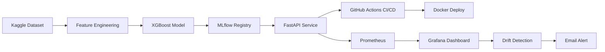

# MLOps Fraud Detection Pipeline


[](https://yieldai-n8n.duckdns.org:8443/demo)

ML models degrade silently in production. Feature distributions shift, prediction confidence drifts, and by the time someone notices, the model has been wrong for weeks.

This project is the detection layer. It's a full MLOps pipeline — but the part that matters is what happens *after* deployment: Prometheus metrics on every prediction, Evidently drift checks on a schedule, Grafana alert rules that fire when the model's behavior changes, and an incident simulation that proves the alerting actually works.

The fraud detection model is the vehicle. The observability stack is the point.

## How It Works



**Inference path**: Transaction → FastAPI validates schema → XGBoost predicts → Prometheus counters increment → result returned in ~2ms.

**Monitoring path**: Prometheus scrapes metrics → Grafana evaluates rules → batch Evidently drift check pushes to Pushgateway → alert fires on fraud spike or feature drift.

## Project Structure

```
mlops-fraud-pipeline/
├── src/
│   ├── api/
│   │   ├── main.py              # FastAPI app (predict, health, metrics, demo)
│   │   └── monitoring.py        # Prometheus custom metrics
│   └── model/
│       └── train.py             # XGBoost training with MLflow tracking
├── demo/
│   └── index.html               # Interactive demo page
├── scripts/
│   ├── download_data.py         # Kaggle dataset download
│   ├── drift_check.py           # Evidently drift detection → Pushgateway
│   ├── fetch_model.py           # Pull champion model from MLflow registry
│   ├── generate_reference.py    # Create drift baseline from training data
│   └── simulate_incident.py     # Fraud spike & distribution shift simulation
├── tests/
│   └── test_api.py              # API endpoint tests (7 tests)
├── docker/
│   ├── prometheus.yml           # Prometheus scrape config
│   └── grafana/provisioning/    # Grafana datasources, dashboards, alerts
├── docs/
│   ├── architecture.md          # Architecture narrative
│   ├── what-i-learned.md        # Personal reflection on building this
│   └── incident-simulation.md   # Incident response documentation
├── data/processed/
│   └── reference.csv            # 5000-row drift baseline
├── Dockerfile                   # Production image
├── docker-compose.yml           # Full local stack
├── requirements.txt
└── .github/workflows/ci-cd.yml  # Test → Build → Deploy pipeline
```

## Technology Choices (and why)

| Layer | Technology | Why not the alternative |
|-------|------------|------------------------|
| Model | XGBoost with `scale_pos_weight=577` | Logistic regression collapsed on recall under 577:1 imbalance. Non-linear feature interaction matters in PCA space. |
| Primary metric | PR-AUC (not ROC-AUC) | A predict-all-legit model scores 0.97 ROC-AUC on this dataset. PR-AUC exposes that. |
| API | FastAPI + Uvicorn | Typed request schemas and auto-generated OpenAPI docs are non-negotiable for MLOps handoff. |
| Drift detection | Evidently DataDriftPreset | Hand-rolled statistical tests mean under-tested code and inconsistent thresholds. |
| Experiment tracking | MLflow 3.x with `@champion` alias | Local-only artifacts can't support promotion, rollback, or CI integration. |
| Monitoring | Prometheus + Grafana + Pushgateway | CloudWatch can't unify request metrics, model metrics, and batch drift metrics in one dashboard. |
| Deployment | Docker + Oracle Cloud Always Free | $0/month, always-on (no cold starts), 4 ARM CPUs, 24GB RAM. |

## The Part That Actually Matters

Grafana alert rules are provisioned from `docker/grafana/provisioning/alerting/`:

| Rule | Condition | Why this threshold |
|------|-----------|-------------------|
| Fraud Rate Spike | `rate(fraud[5m]) / rate(total[5m]) > 0.005` sustained 1min | Baseline is 0.17%. 0.5% is ~3× baseline — high enough to avoid noise from test traffic, low enough to catch real degradation. |
| Data Drift Warning | `drift_share_of_drifted_columns > 0.5` fires immediately | If over half of features drift together, the cause is upstream data change, not random variance in one feature. |

Both rules route to an email contact point configured via SMTP.

The incident simulation (`scripts/simulate_incident.py`) proves these alerts actually fire — it's not theoretical, it's tested. See [docs/incident-simulation.md](docs/incident-simulation.md) for the full writeup.

## Running Locally

```bash
# Clone and enter
git clone https://github.com/nanthansr/mlops-fraud-pipeline
cd mlops-fraud-pipeline

# Download data (requires Kaggle API key)
python scripts/download_data.py

# Train model
python src/model/train.py

# Start full stack (API + Prometheus + Grafana)
docker compose up --build

# API docs
open http://localhost:8000/docs

# Demo page
open http://localhost:8000/demo

# Grafana dashboard
open http://localhost:3000  # admin / admin

# Run tests
pytest tests/ -v
```

### Simulating Incidents

```bash
python scripts/simulate_incident.py --incident fraud_spike
python scripts/simulate_incident.py --incident distribution_shift
```

See [docs/incident-simulation.md](docs/incident-simulation.md) for detailed incident response documentation.

## Things I'd Explain in an Interview

| Decision | Why | What I rejected |
|----------|-----|-----------------|
| PR-AUC as primary metric | Positive class is 0.17% — ROC-AUC hides poor fraud recall | Accuracy, ROC-AUC alone |
| Pull champion model from MLflow in CI | Deploys a reviewed artifact, not an ad-hoc retrain | Train-on-every-push |
| One S3 object per prediction | S3 has no safe append; partitioned objects support replay and drift | Append-in-place files |
| Pushgateway for batch drift metrics | Drift job is short-lived; Prometheus can't scrape after exit | Long-running fake exporter |
| Fraud alert sustained 1min | ~3× baseline reduces noise; sustained window avoids false alarms from test traffic | Ultra-low instant thresholds |
| OIDC for CI → AWS auth | Short-lived STS tokens per job; no stored access keys | IAM keys in GitHub secrets |
| Image tagged with `github.sha` | Full traceability — every image maps to an exact commit | `latest` tag |

For a longer reflection on what was hardest, what I'd change, and what this project deliberately doesn't do, see [docs/what-i-learned.md](docs/what-i-learned.md).

## Dataset

[Credit Card Fraud Detection](https://www.kaggle.com/datasets/mlg-ulb/creditcardfraud) on Kaggle:
- 284,807 transactions with 492 fraud cases (0.17%)
- Features V1–V28 (PCA-transformed) + Amount + Time
- Target: 0 = legitimate, 1 = fraud

## Author

Nanthan Srikumar · [LinkedIn](https://www.linkedin.com/in/nanthan-sr/) · [GitHub](https://github.com/nanthansr)

## License

[MIT](LICENSE)
