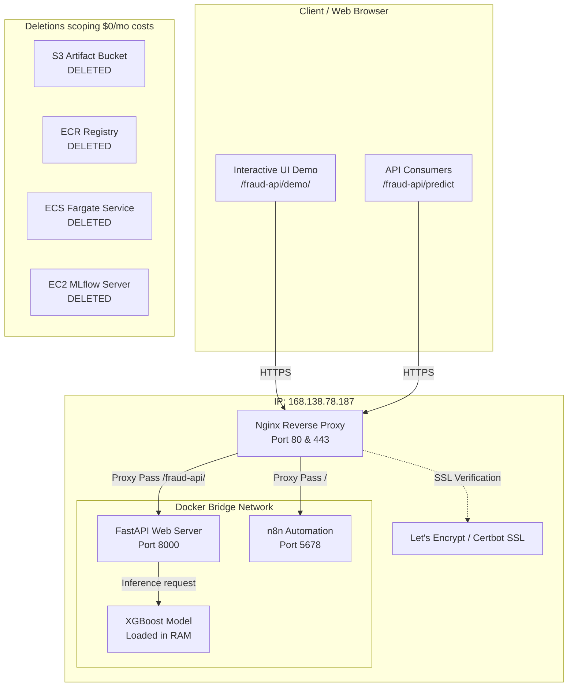
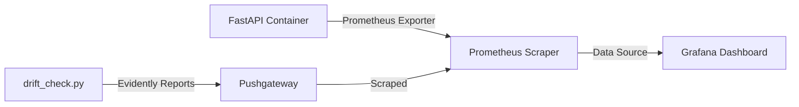

# System Architecture & Hosting Map

This document outlines the operational architecture of the production ML observability pipeline. To ensure the project remains sustainable for a portfolio showcase, all components are hosted on **$0/month free-tier infrastructure**.

---

## Active Deployed Architecture

The production environment runs entirely within a single **Oracle Cloud Always Free VM** (ARM-based, 4 OCPUs, 24 GB RAM) and uses **Nginx** for path-based reverse proxy routing and SSL offloading.

### Components in Oracle Cloud VM:
1. **Nginx Reverse Proxy**: Routes incoming traffic.
   * Traffic to `https://yieldai-n8n.duckdns.org/` is routed to the `n8n` automation service (port 5678).
   * Traffic to `https://yieldai-n8n.duckdns.org/fraud-api/*` is routed to the prediction API (port 8000).
2. **FastAPI Web Server**: Serves inference requests and the static interactive dashboard page.
3. **XGBoost Classifier Model**: The trained model binary (`model.joblib`) is baked directly into the Docker image filesystem and loaded in RAM on startup for low-latency (~2ms) local predictions.
4. **n8n Container**: Exposes your workflow editor alongside the API.

---

## Decommissioned AWS Resources (Inactive)

To eliminate AWS recurring fees (~$30-35/month), all previously deployed cloud infrastructure was torn down. S3 artifact storage, ECS Fargate clusters, ECR container registries, and EC2 telemetry hosts are **fully inactive** and carry **$0.00** billing weight.

---

## Local Development & Observability Architecture

During development or debugging sessions, the full observability stack can be spun up locally via Docker Compose:

* **Prometheus** scrapes metric endpoints from the local app.
* **Evidently** compares input distributions against the reference dataset and pushes drift gauges to the **Pushgateway**.
* **Grafana** aggregates online latency/prediction metrics and offline drift data onto a unified monitoring panel.
